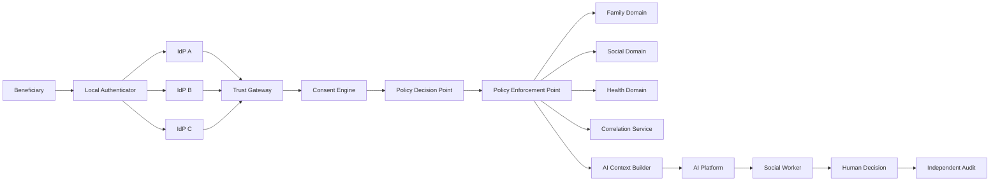
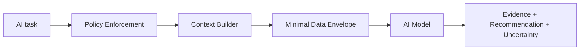

# Architecture

## 1. Objective

The architecture separates five forms of power that are commonly collapsed in high-risk information systems:

1. identity power;
2. data custody;
3. authorization power;
4. AI analytical power;
5. final human decision authority.

The system is designed so that compromise or misuse of one domain does not automatically expose the complete person.

## 2. Trust domains



## 3. Identity

Biometrics are used only for local activation of an authenticator. Raw biometric data and templates are outside the CPIMS+ trust boundary.

Each external provider returns an independently signed assertion. The Trust Gateway accepts a session only when at least two of three assertions are valid and bound to the same authentication transaction.

A provider assertion is not a CPIMS+ identity token. CPIMS+ uses gateway-issued, scoped session credentials.

## 4. Pseudonym model

No universal child identifier is exposed across domains.

Example:

```text
Identity Domain : PPI-I-...
Family Domain   : PPI-F-...
Social Domain   : PPI-S-...
Health Domain   : PPI-H-...
Education Domain: PPI-E-...
AI transaction  : AICTX-...
```

A protected Correlation Service maintains only the minimum binding required to resolve scoped relationships. It does not store full case narratives.

## 5. Session hierarchy

```text
External signed assertions
        ↓
Trust Gateway Session
        ↓
Consent Receipt
        ↓
Policy authorization
        ↓
Domain-scoped request
        ↓
Ephemeral AICTX, if AI is needed
```

No identifier is itself an authorization credential.

## 6. Data classification

### L1 — Operational
Routine information required to operate a case workflow.

### L2 — Sensitive social/family
Family structure, social-work observations, living conditions, and similar data.

### L3 — Highly sensitive
Health, violence, abuse, psychological, and other high-impact information.

### L4 — Exceptional / restricted
Data whose disclosure could produce severe harm or enable coercion, targeting, or irreversible consequences.

L4 is not a superuser tier. It is an authorization tier requiring additional independent oversight.

## 7. Authorization model

The policy system evaluates more than role:

```text
identity assurance
+ worker role
+ case assignment
+ purpose
+ consent state
+ requested data layer
+ device/workload trust
+ time
+ risk state
+ independent authorization where required
```

The architecture therefore combines RBAC, ABAC, purpose limitation, and explicit consent/authority.

## 8. AI boundary

AI has no direct access to production databases, object stores, identity vaults, or correlation anchors.



The Context Builder prefers derived attributes. For example, `age_group=10-12` is preferred over exposing date of birth when the exact date is unnecessary.

## 9. AI context tokens

AICTX identifiers are:

- ephemeral;
- single-purpose;
- short-lived;
- non-global;
- not reusable as case identifiers;
- invisible to external identity providers.

Expiration of AICTX terminates the model's authorization context.

## 10. Human-in-command

The AI layer may provide evidence, alternatives, uncertainty, missing information, and recommendations.

Final high-impact actions must be taken by an accountable human role. The system API must not expose AI-callable actions that independently approve reunification, remove a child, deny a service, or issue a legal action.

## 11. Independent authorization

For L4 disclosures, the architecture uses an independent authorization authority, potentially judicial where appropriate to the legal context.

The authority does not receive global browse rights. It issues a narrow authorization describing:

- scoped case reference;
- purpose;
- requester;
- permitted operation;
- export policy;
- expiry.

## 12. Audit

Audit events leave the operational application and are written into an independent append-only or tamper-evident audit system.

Audit data itself must be minimized to avoid becoming a second identity graph.

## 13. Administrative separation

There is no `GLOBAL_SUPERADMIN` role.

Infrastructure, identity, database, policy, privacy, audit, and AI platform administration are separate responsibilities. Sensitive cryptographic operations may require M-of-N approval.

## 14. Backup and recovery

Backups preserve domain separation and independent keying. A single full-database dump that reassembles all domains is contrary to this architecture.

## 15. Kubernetes boundary

Kubernetes may host implementation components, but network placement does not establish trust. Service-to-service authorization must be identity- and policy-based. Identity, policy, CPIMS application, AI, and audit domains should have explicit workload identities and constrained network paths.

## 16. Architecture acceptance property

> A single failure, credential compromise, provider compromise, database breach, or administrative account compromise must not expose the whole person.

This is the primary architectural test.
