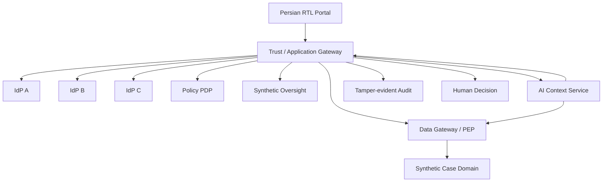

# CPIMS+ AI — Human-Centered, Privacy-Preserving Reference Architecture

> **Status:** Research / runnable synthetic lab + Persian Primero implementation overlay. **No real child, family, refugee, beneficiary, biometric, or case data is permitted in this repository.**

## What this project is

CPIMS+ AI is an independent research project exploring how AI can assist social workers in high-stakes child-protection and humanitarian contexts without concentrating identity, data, institutional power, and AI decision authority in one place.

> **AI may assist. Humans remain accountable for decisions.**

This repository is not an endorsed deployment of CPIMS+, and it is not endorsed by UNICEF, WFP, NIST, any government, or any international organization. The official CPIMS+ configuration bundles are distributed separately by the upstream Primero/CPIMS+ maintainers and are **not** reproduced here.

## Runnable synthetic lab

[`lab/`](lab/README.md) is a runnable Persian/RTL synthetic environment that turns the architecture into an executable workflow.

```bash
cd lab
docker compose up --build
```

Open:

```text
http://localhost:8080
```

The lab demonstrates:

- three mock IdPs and a **2-of-3** Trust Gateway;
- issuer, audience, nonce, freshness, expiry, replay, and same-subject binding checks;
- opaque sessions and pairwise provider pseudonyms;
- consent separate from authentication;
- L2 consent and L3 step-up consent;
- PDP/PEP separation and network-isolated synthetic case data;
- L4 denial unless a separate case/purpose/requester/time-bound legal authorization exists;
- an oversight service that can authorize a narrow disclosure but cannot browse case data;
- AI with no route to the case service and no final-decision endpoint;
- human decision recording separate from AI output;
- pseudonymous, tamper-evident audit chaining;
- synthetic-only Persian case records.

Only the portal is exposed to the host. The Docker networks deliberately separate identity, policy, enforcement, data, AI, and audit trust domains.

The three IdP containers are a **logical simulation**, not evidence of real-world provider independence across vendors, jurisdictions, infrastructure, keys, DNS/CDN, or operational administration. The lab uses development-only HMAC tokens to stay dependency-free and inspectable; those token formats and checked-in development keys must never be used in production.

## Persian Primero implementation

[`implementation/`](implementation/README.md) is a reproducible localization/security overlay for the open-source **Primero v2.14.5** codebase used by CPIMS+.

It uses Primero's existing `fa-AF` translation structure to generate an Iranian Persian `fa-IR` locale with equivalent translation-key coverage, RTL registration, fallback configuration, terminology normalization, and automated QA. Professional Iranian child-protection, legal, medical, and safeguarding terminology review remains mandatory before real deployment.

Primero itself is not copied into this repository. The overlay is designed to be applied to an authorized Primero/CPIMS+ installation.

## Core architectural principles

1. **No single point of complete knowledge** — no provider, administrator, model, database, social worker, or oversight actor should independently possess the complete identity and life history of a beneficiary.
2. **Identifier is not authority** — possession of a token, pseudonym, case reference, or session ID does not itself grant access.
3. **Purpose-bound disclosure** — every disclosure needs a subject, purpose, scope, basis, operation, and expiry.
4. **Human-in-command** — AI may retrieve, summarize, compare, explain, identify uncertainty, and recommend; it must not independently determine a child's fate.
5. **Distributed trust** — sensitive trust and privilege should be separated rather than concentrated.
6. **Local biometric activation only** — the intended production architecture keeps raw biometric material out of CPIMS+, AI, analytics, logs, and backups.
7. **Pairwise pseudonymity** — reusable global child identifiers are forbidden across trust domains.
8. **Minimum necessary context** — AI receives derived/minimized attributes where possible.
9. **Independent auditability** — sensitive access and AI-assisted workflows must remain attributable and reviewable.
10. **Synthetic-first** — real beneficiary data remains prohibited until independent architecture, privacy, security, legal, child-protection, and ethics gates are passed.

## NIST alignment

This project is **NIST-aligned, not NIST-certified and not a claim of NIST compliance**. Design references include:

- NIST SP 800-63-4 family — Digital Identity Guidelines
- NIST SP 800-207 — Zero Trust Architecture
- NIST SP 800-207A — cloud-native zero trust concepts
- NIST SP 800-53 Rev. 5 — security and privacy controls
- NIST Cybersecurity Framework 2.0
- NIST Privacy Framework
- NIST AI Risk Management Framework

The 2-of-3 identity threshold, layered consent model, and judicial/independent authorization design are project-specific controls, not NIST requirements.

## Repository map

- [`PROJECT.yaml`](PROJECT.yaml) — machine-readable project manifest and invariants.
- [`ARCHITECTURE.md`](ARCHITECTURE.md) — trust boundaries, components, token model, and data flow.
- [`PHILOSOPHY.md`](PHILOSOPHY.md) — human-centered philosophy.
- [`AI_CHARTER.md`](AI_CHARTER.md) — permitted and forbidden AI authority.
- [`THREAT_MODEL.md`](THREAT_MODEL.md) — adversaries, abuse cases, failures, and residual risk.
- [`DATA_GOVERNANCE.md`](DATA_GOVERNANCE.md) — classification, minimization, lifecycle, and disclosure.
- [`CONSENT_IDENTITY.md`](CONSENT_IDENTITY.md) — identity, consent, federation, and step-up authorization.
- [`NIST_MAPPING.md`](NIST_MAPPING.md) — architecture-to-NIST reference mapping.
- [`SECURITY.md`](SECURITY.md) — repository security and real-data prohibition.
- [`implementation/`](implementation/README.md) — Persian Primero localization and security reference code.
- [`lab/`](lab/README.md) — runnable synthetic CPIMS+ security/governance lab.
- [`docs/README.fa.md`](docs/README.fa.md) — Persian project introduction.

## Lab flow



The public gateway is not attached to the case-data network, the oversight service is not attached to the case-data network, and the AI service cannot call the case service directly.

## Validation

The repository contains separate GitHub Actions workflows for:

- Persian Primero overlay validation;
- security-reference tests;
- synthetic-lab unit and E2E tests;
- Docker Compose build/start/health smoke testing.

A green CI result means the research implementation is reproducible under its tests. It does **not** establish production security, legal compliance, child-safeguarding adequacy, or fitness for real beneficiary data.

## Safety boundary

This repository intentionally contains no real beneficiary records, biometric samples/templates, production tokens, organization secrets, production IPs/hostnames, or operational infrastructure credentials. Synthetic identifiers and development secrets are visibly marked as such.

## Licensing

Original architecture documents and original reference/lab code in this repository are released under the repository MIT license. Primero itself is licensed under **GNU AGPL-3.0-or-later**. Generated localization files based on Primero resources and modifications applied to a Primero checkout must be handled consistently with the upstream license and notices. This repository does not relicense Primero.

## Research question

> **Can an AI-enabled humanitarian or child-protection system provide enough information to help a professional act responsibly, while ensuring that no single actor — human, institutional, technical, or artificial — possesses enough information and authority to control the whole person?**
