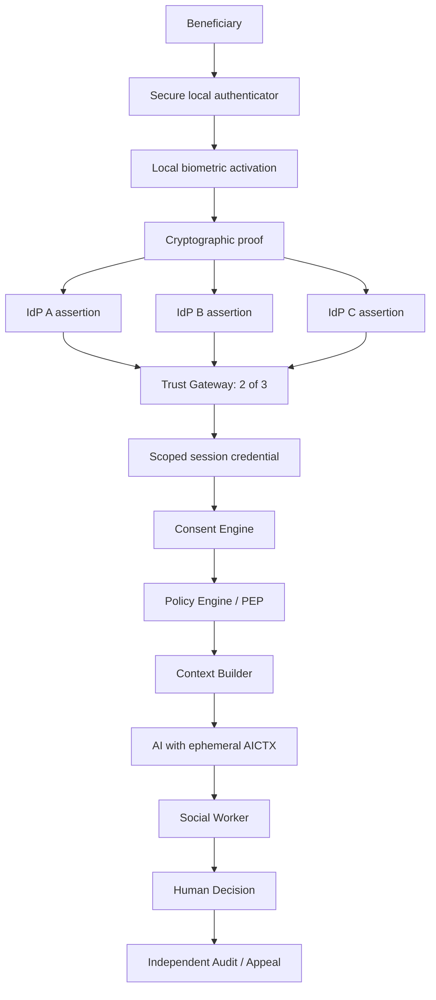

# CPIMS+ AI — Human-Centered, Privacy-Preserving Reference Architecture

> **Status:** Research / Synthetic PoC only. **No real child, family, refugee, beneficiary, biometric, or case data is permitted in this repository.**

## What this project is

CPIMS+ AI is an individual research project exploring how artificial intelligence can assist social workers in high-stakes child-protection and humanitarian contexts without concentrating identity, data, institutional power, and AI decision-making in one place.

The architecture is intentionally designed around a simple rule:

> **AI may assist. Humans remain accountable for decisions.**

The project is not a deployment of CPIMS+ and is not endorsed by UNICEF, WFP, NIST, or any government or international organization. It is an independent reference architecture and case-study proposal.

## Core architectural principles

1. **No single point of complete knowledge** — no provider, administrator, model, database, social worker, or oversight actor should independently possess enough information to reconstruct the complete identity and life history of a beneficiary.
2. **Identifier is not authority** — possession of a token, pseudonym, case reference, or session ID never grants access by itself.
3. **Purpose-bound disclosure** — every disclosure must have a subject, purpose, scope, legal/consent basis, and expiry.
4. **Human-in-command** — AI can search, summarize, compare, explain, surface evidence, and recommend. It must not independently decide family reunification, removal, denial of service, legal status, or other high-impact outcomes.
5. **Distributed trust** — identity trust is not concentrated in one external provider. The research design uses independent attestations and a 2-of-3 policy at a trust gateway.
6. **Local biometric activation** — biometrics are intended only to unlock a local authenticator/private key. Raw biometric data and biometric templates are not part of CPIMS+, AI, or analytics storage.
7. **Pairwise pseudonymity** — domains use different pseudonymous identifiers to reduce cross-domain correlation.
8. **Minimum necessary context** — AI receives derived or minimized attributes instead of raw identity data wherever possible.
9. **Independent auditability** — sensitive access and AI-assisted recommendations must be attributable and reviewable without creating a second shadow identity database.
10. **Synthetic-first** — the architecture must pass security, privacy, red-team, governance, and ethics gates before any consideration of real beneficiary data.

## NIST alignment

This project is **NIST-aligned, not NIST-certified or NIST-compliant by claim**. The architecture draws from:

- NIST SP 800-63-4 family — Digital Identity Guidelines
- NIST SP 800-207 — Zero Trust Architecture
- NIST SP 800-207A — cloud-native zero trust concepts
- NIST SP 800-53 Rev. 5 — security and privacy controls
- NIST Cybersecurity Framework 2.0
- NIST Privacy Framework
- NIST AI Risk Management Framework (AI RMF)

The 2-of-3 identity-attestation design, judicial/independent authorization model, layered consent model, and several child-protection safeguards are **project-specific controls**, not requirements imposed by NIST.

## Repository map

- [`PROJECT.yaml`](PROJECT.yaml) — machine-readable project manifest and architectural invariants.
- [`ARCHITECTURE.md`](ARCHITECTURE.md) — system components, trust boundaries, token model, and data flow.
- [`PHILOSOPHY.md`](PHILOSOPHY.md) — human-centered philosophy and limits of the project.
- [`AI_CHARTER.md`](AI_CHARTER.md) — what AI is and is not permitted to do.
- [`THREAT_MODEL.md`](THREAT_MODEL.md) — adversaries, abuse cases, failure modes, and residual risk.
- [`DATA_GOVERNANCE.md`](DATA_GOVERNANCE.md) — data classification, minimization, lifecycle, and disclosure rules.
- [`CONSENT_IDENTITY.md`](CONSENT_IDENTITY.md) — identity, local biometrics, 2-of-3 attestation, consent, and step-up authorization.
- [`NIST_MAPPING.md`](NIST_MAPPING.md) — reference mapping from architecture functions to NIST publications/control families.
- [`SECURITY.md`](SECURITY.md) — repository security policy and prohibition on real beneficiary data.
- [`docs/README.fa.md`](docs/README.fa.md) — معرفی و اصول پروژه به زبان فارسی.

## High-level flow

## Safety boundary

This repository intentionally does **not** contain:

- production Kubernetes manifests tied to a real organization;
- real IP addresses, hostnames, credentials, API keys, storage paths, or infrastructure identifiers;
- real beneficiary records or screenshots;
- biometric samples or templates;
- real case tokens or identity mappings;
- instructions for bypassing lawful access controls or concealing illegal activity.

## Licensing and public-interest intent

The project is intended to be reusable, inspectable, criticizable, and machine-readable. The software and documentation in this repository are released under the repository license. The ethical principles in this project express the author's intended use but do not silently modify the terms of the license.

## Research question

> **Can an AI-enabled humanitarian or child-protection system provide enough information to help a professional act responsibly, while ensuring that no single actor — human, institutional, technical, or artificial — possesses enough information and authority to control the whole person?**

That question, rather than the sophistication of the model, is the center of this project.
