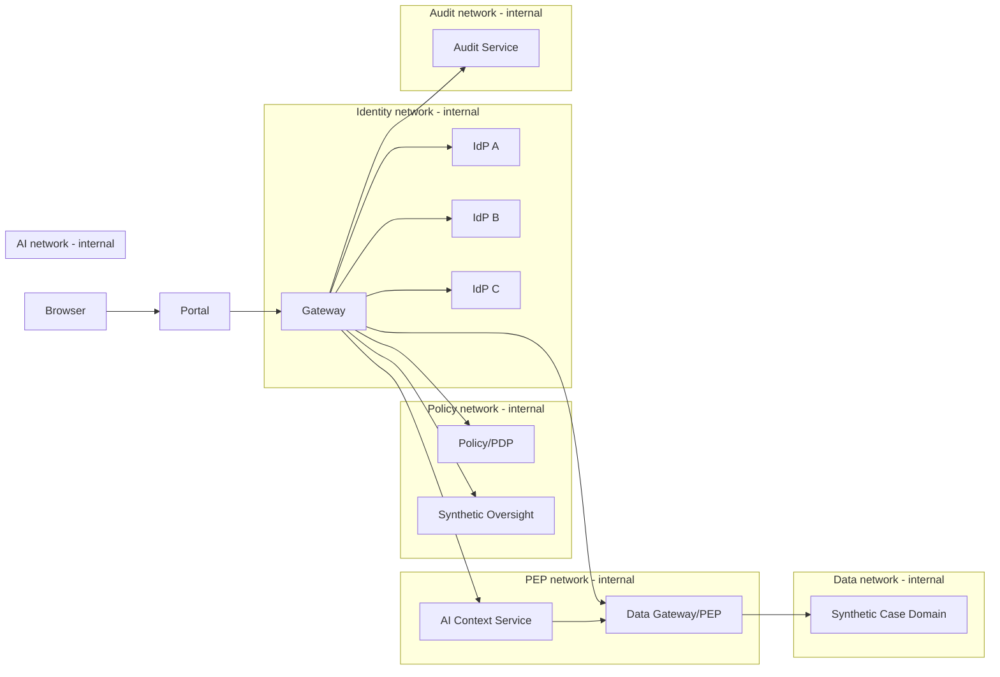

# Synthetic CPIMS+ AI Lab

> **Research / synthetic-only environment. No real child, family, biometric, refugee, beneficiary or case data is permitted.**

This directory is a runnable laboratory that implements the trust and data-flow ideas documented in this repository without pretending to be the official CPIMS+ deployment configuration.

## Start

Requirements: Docker Engine + Docker Compose v2.

```bash
cd lab
docker compose up --build
```

Then open:

```text
http://localhost:8080
```

To reset the tamper-evident synthetic audit log:

```bash
docker compose down -v
```

## What the lab demonstrates

The Persian RTL portal exercises a full synthetic workflow:

1. Three isolated mock identity providers issue independent signed assertions.
2. The gateway requires at least **2 of 3** valid assertions and validates issuer, audience, nonce, freshness, expiry, replay and cross-provider binding.
3. The gateway creates an **opaque session**. The browser does not receive the internal subject anchor.
4. Authentication and consent are separate. L2 requires consent and L3 requires step-up consent.
5. The Policy service acts as the PDP. The Data Gateway is the PEP.
6. The public-facing Gateway has **no network route to the Case service**.
7. The AI service also has **no direct route to the Case service**; it must use the Data Gateway with a short-lived policy decision token.
8. L4 requires a separate, case-scoped, read-only, time-limited synthetic judicial authorization. The oversight service has no route to case data.
9. AI receives only allowed fields and refuses identity-like fields. The lab AI is a deterministic rule engine, not an LLM.
10. Human decisions are recorded separately from AI output.
11. Audit events use a pseudonymous subject reference and an append-only hash chain.

## Docker trust boundaries



The separation is intentional: `gateway` is not attached to `data_net`, `oversight` is not attached to `data_net`, and `ai` cannot call the case service directly.

## Synthetic identities and cases

The lab contains three synthetic subject slots and three matching synthetic cases. They contain no names, national identifiers, addresses, phone numbers, emails, biometric data, or real-world case details.

Pairwise IdP subjects are different for A/B/C. A private binding registry in the Trust Gateway maps them to an internal synthetic subject anchor. This registry contains no case narrative.

## Important security limitations

This environment intentionally avoids external Python packages so it can be inspected easily. Consequently, its signed assertions and internal policy tokens use HMAC for demonstration. **Do not use these lab token formats or checked-in development keys in production.** A real implementation should use standardized federation/authentication protocols, vetted crypto libraries, asymmetric verification keys, hardware-backed authenticators where appropriate, workload identity/mTLS, KMS/HSM-backed key management, PAM/JIT administration, and independent audit storage.

The `2-of-3` design is a project-specific control, not a NIST requirement.

## L4 and judicial authority

The synthetic oversight service can issue only a specific object:

- one case;
- one requester;
- one purpose;
- `read` operation only;
- five-minute validity.

It does **not** receive a database account and cannot browse or export case data. This illustrates the distinction between **legal authority to authorize a disclosure** and **standing technical privilege to read everything**.

## AI boundary

`ai` receives a policy decision token, calls the Data Gateway, and receives only policy-selected context. It explicitly rejects identity-like keys. Its output contract contains:

- evidence;
- recommendation;
- confidence;
- uncertainty;
- missing evidence;
- alternative explanation;
- model version;
- `decision_authority: false`.

The lab does not expose an endpoint for the AI to approve reunification, deny service, remove a child, or authorize disclosure.

## Run unit tests without Docker

```bash
cd lab
python -m unittest -v tests.test_lab
```

Run the multi-process end-to-end workflow without Docker:

```bash
python tests/e2e_lab.py
```

## Production gate

A successful lab run proves only that the reference workflow is executable. It does **not** prove legal compliance, child-safeguarding adequacy, NIST compliance, production security, or fitness for a real CPIMS+ deployment.
